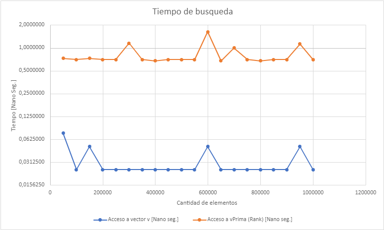

# Mini-Proyecto II: Estructuras de Datos Compactas
</br>
<b>Felipe Cerda</b>
<b>Cristian Perez</b>
<b>Vicente Schultz</b>
</br>

## Introducción

Para realizar este proyecto recurrimos a la librería SDSL que proporciona muchas estructuras de datos compactas. 

Un `int_vector<w>` es un contenedor de enteros de una anchura fija de w bits. 

La función `size_in_bytes(o)` de la librería SDSL, retorna el espacio que ocupa un objeto o de SDSL. 

Las clases `sd_vector` y `rrr_vector` son implementaciones compactas de un bitmap que soportan la operación `rank` en tiempo `O(1)`. Para el desarrollo de este proyecto usamos `rrr_vector` (que es la que utiliza menos espacio) toda vez que necesitamos almacenar cadenas de bits.

Para poder calcular `rank` utilizamos la clase Rank Support de la SDSL. Esta provee soporte de rank para las distintas implementaciones de bitvector que ofrece.

La función `util::bit_compress()`, determina el mayor valor X, y así ajusta la anchura al menor valor posible para seguir representando los mismos valores.

La clase `k2-tree` provee la implementación de la estructura de datos homónima. Originalmente pensada para la representación de grafos web. Los grafos web son grafos en los que cada nodo representa una dirección web y cada arista un hipervínculo entre una y otra. Estos grafos pueden pesar sobre 600GB. Al ser un grafo hiperconectado, surge la necesidad de almacenarlo de manera compacta. Básicamente k2-tree es una representación compacta de una matriz de adyacencia y que además soporta navegación hacia adelante y atrás. Se saca provecho del hecho de que en la matriz de adyacencias hay grandes áreas vacías.
  

En adelante solo se hará referencia a las estructuras antes descritas sin entraremos en mayores detalles.

## Ejercicios

### 1. Calcular $H_0$ para cada uno de los datasets.

**R:** Función para obtener la Entropía de Shannon de un dataset. Una vez leído el dataset actual, se almacenan los valores en un objeto v `int_vector<>` que pertenece a la **librería SDSL.** (Problema 2). Toda la información que se trabajará, incluyendo quedará guardada en la clase llamada `raster`. Luego, se procede a calcular la entropía, aplicando la siguiente fórmula al código: 

$H = -\Sigma_{i=1}^{N}p_ilog(p_i)$

```cpp
double raster::get_Entropy()
{
// lleno mapa con los valores del int_vector v
    map<int, int> myMap;

    for (int i = 0; i < v.size(); i++)
    {
        int number = v[i];
        auto it = myMap.find(number);
        if(it == myMap.end())
            myMap.insert(make_pair(number,1));
        else
            it->second++;
    }

// calcula cantidad de datos N en el int_vector v
    int n = 0;
    for(auto it = myMap.begin(); it!=myMap.end(); it++)
        n += it->second;
    H = 0;
// calcula probabilidades y obtiene la entropia
    for(auto it = myMap.begin(); it!=myMap.end(); it++){
        double dato_map = (double)it->second/(double)n;
        H += dato_map*log2(dato_map);
    }
    H *= -1;

// retorna un double con la entropia del data_set
    return H;
}
```

**Evaluación experimental:**
Los resultados obtenidos para las entropías de los tres dataset son las siguientes: 
- $H_0(8x8)$ = 1.1223
- $H_0(128x128)$ = 1.89803
- $H_0(512x512)$ = 4.5655

### 2. Para cada dataset, leer las matrices por filas (row-major order) y almacenar los valores en `int_vector<>`.

**R:** Recorremos el directorio que contiene los archivos, luego vamos linea por linea leyendo las lecturas de temperatura de izquierda a derecha (row-major order) y almacenandolas en un `int_vector`, clase que pertenece a la **librería SDSL.** 

```cpp
// lee los data_sets y los guarda en un int_vector "v"
void raster::set_int_vector(string path)
{
// leo los files donde se encuentra el data_set y los guardo en un vector auxiliar
    set<filesystem::path> pathOrdenados;
    for (auto & p : filesystem::directory_iterator(path))
        pathOrdenados.insert(p.path());

    vector<int> auxVec;
    for (auto & archivo : pathOrdenados)
    {
        ifstream file(archivo.string(), ios::in);
        string linea;
        vector<vector<int>> matriz;
        while(getline(file, linea))
        {
            stringstream sstream(linea);
            string s;
            vector<int> vecPrevio;
            while(sstream >> s) 
            { // aqui se guardan las lineas de numeros
                auxVec.push_back(stoi(s));
                vecPrevio.push_back(stoi(s));
            }
            // aqui se guardan las lineas dentro de una matriz
            matriz.push_back(vecPrevio);
        }
        // aqui se guarda la matriz en el arbol
        mat_list.push_back(matriz);
        file.close();
    }

// guardo los datos del vector auxiliar en el int_vector v
    v.resize(auxVec.size());
    for (int i = 0; i < auxVec.size(); i++)
    {
        v[i] = auxVec[i];
    }
    // para ver los datos en el int_vector v
    //cout<< v << endl;
}
```
**Evaluación experimental:**

Para calcular el espacio utilizado, se usa la función `size_in_bytes(o)`. Los objetos `int_vector` ocupan espacio según como se describe a continuación (bytes):
- 8x8: 61,449
- 128x128: 15,728,649
- 512x512: 251,658,249

Luego, es posible usar `util::bit_compress()`. De esta forma, el espacio pasa a ser (bytes):
- 8x8: 4,809
- 128x128: 1,474,569
- 512x512: 23,592,969
  
### 3. Codificar los vectores anteriores de manera que valores consecutivos repetidos (runs) se representen una única vez. Para ello se empleará un bitmap b que marcará con 1 el inicio del run y con 0s los elementos repetidos. La secuencia de valores sin repetición se almacenará en un `int_vector<>`. Ejemplo, `v={3,3,3,2,1,5,5,5,7,7,7}` se representará como `b={1,0,0,1,1,1,0,0,1,0,0}` y `v’={3,2,1,5,7}`

**R:** La función `convert_to_succint_version()` toma el vector inicial y lo convierte a su forma compacta: `b` un bitmap y `v'` un vector que contiene la secuencia original, pero ignorando las repeticiones sucesivas. De la librería SDSL se utilizó `rrr_vector` para `b` y `int_vector` para `v'`. 

```cpp
void raster::convert_to_succint_version()
{
    b.resize(v.size());
    vector<int> valores;
    valores.push_back(v[0]);
    b[0] = 1;
    int j=1;
    int k=1;
    for(int i=1; i<v.size(); i++){
        if(v[i]==v[i-1]){
            b[j] = 0;
            j++;
        }else{
            b[j] = 1;
            j++;
            valores.push_back(v[i]);
            k++;
        }
    }
 
    vPrima.resize(valores.size());
    for (int i = 0; i < valores.size(); i++)
        vPrima[i] = valores[i];
 
    rrrv = rrr_vector<>(b);
    rrrv_rank.set_vector(&rrrv);
    rrr_vector<> rrrv(b);
}
```

**Análisis Experimental:**

Haciendo uso de la función `size_in_bytes()` de la librería SDSL, mostramos el tamaño que ocupan las distintas estructuras de datos. Se incluye el espacio del vector `v`.

Para `8x8`:
- `b`: 355 bytes
- `v'`: 3,209 bytes
- `v`: 61,449 bytes

Para `128x128`:
- `b`: 116,155 bytes
- `v'`: 1,509,753 bytes
- `v`: 15,728,649 bytes

Para `512x512`:
- `b`: 3,034,403 bytes
- `v'`: 52,003,553 bytes
- `v`: 251,658,249 bytes

### 4. Dada la representación anterior, soportar acceso a la posición i. Para ello, el bitmap se representará como un rrr_vector o un sd_vector (el que mejor espacio obtenga) con soporte para rank. Tener en cuenta que `v[i]=v’[rank(b,i)]`.
   
**R:** Para acceder a la posición $i$ usamos la función `at()`. Esta función utiliza el índice $j = rank(i) - 1$ que finalmente nos permite encontrar el valor buscado en `vPrima`. Para calcular `rank` utilizamos la clase `rank_support` perteneciente a la **librería SDSL**.

```cpp
int raster::at(int indx)
{
    return vPrima[rrrv_rank(indx) - 1];
}
```

**Evaluación:**

Sabemos que acceder a la posición $i$ en la implementación toma tiempo constante. Si comparamos con la implementación compacta, tenemos un acceso `int valor = vPrima[j];` y adicionalmente una llamada a `rrrv_rank` que también toma tiempo constante. Teóricamente, ambas son equivalentes, al funcionar en tiempo constante. Sin embargo, la implementación compacta siempre toma un poco más. Es un trade-off pequeño si se toman en cuenta las mejoras de espacio.

**Evaluación experimental:**

Compararemos el tiempo que toma acceder a la posición i en ambas implementaciones para el dataset de `8x8`. Se omiten las demás comparaciones por ser equivalentes.

Para `8x8`:




### 5. Sea $M_i$ la matriz en el instante $i$. Para toda matriz $Mi, i>=1$ (es decir, todas menos la primera de cada dataset), crear una matriz binaria $BM_i$ de tal forma que $BM_i[x][y]=(M_i[x][y]<>M_{i-1}[x][y])$. Es decir, para cada celda, almacena un 1 si el valor es diferente al valor de la misma celda en el instante anterior, y un 0 en caso contrario. Representar cada una de las matrices resultantes con un `k2-tree (sdsl/k2_tree.hpp)` y reportar el espacio que suman en total. Nota: el k2-tree no aparece en la cheat sheet por haber sido incorporado más tardíamente.

**R:** Cada matriz $BM_i$ queda guardada temporalmente en un vector de matrices llamado `matriz3d`. Luego, cada matriz es transformada a un `k2_tree` para poder manejar mejor el espacio de cada una de estas a nivel de bits. Esto se muestra en la función `creark2Tree()`:

```cpp
void raster::creark2Tree()
{
    vector<vector<vector<int>>> matriz3d;
    int sumaBytes=0;
    for (int i = 1; i < mat_list.size(); i++)
    {
        vector<vector<int>> mat;
        auto mi_1 = mat_list[i - 1];
        auto mi = mat_list[i];
        for (int j = 0; j < mi_1.size(); j++)
        {
            vector<int> fila;
            for (int k = 0; k < mi_1.size(); k++)
            {
                int diff = (mi_1[j][k] != mi[j][k]); // resultado de la expresion y lo almacena
                fila.push_back(diff);
            }
            mat.push_back(fila);
        }

        matriz3d.push_back(mat);
        k2_tree<2> k2Aux(mat);
        //cout<<"BM_"<<i<<": "<<size_in_bytes(k2Aux)<<endl;
        sumaBytes += size_in_bytes(k2Aux);
    }
    cout<<"La suma total de todos los k2_tree es: "<<sumaBytes<<" bytes."<<endl;
}
```
Luego, se calcula la suma de todo el espacio que ocupa cada `k2_tree`, y se muestra por consola el espacio que ocupa el dataset completo en base a esta estructura mencionada.

### 6. Por cada matriz, representar las diferencias con la matriz anterior de manera compacta. Pista: ejercicios 2 y 3. Nota: observar que las diferencias pueden ser negativas y debe proponerse alguna solución a dicho problema.

**R:** La implementación es similar a la de los ejercicios 2 y 3. Tenemos un `bitmap` y `v'`, pero en lugar de guardar las lecturas guardamos las diferencias, $D_i = (M_i[x][y] - M_{i-1}[x][y])$ en `v'`. En el `bitmap` guardaremos un 1 cuando $D_{i+1} \neq D_i$.  

```cpp

```

**Análisis Experimental:**

Haciendo uso de la función `size_in_bytes` de la librería SDSL, mostramos el tamaño que ocupan las distintas estructuras de datos. Para efectos de comparación se incluye el vector de diferencias `v'`, el bitmap y `M` que representa la sumatoria del espacio que ocupan las matrices originales.

Para `8x8`:
- `M`: bytes
- `v'`: bytes
- `b`:  bytes

Para `128x128`:
- `M`: bytes
- `v'`: bytes
- `b`: bytes

Para `512x512`:
- `M`: bytes
- `v'`: bytes
- `b`: bytes